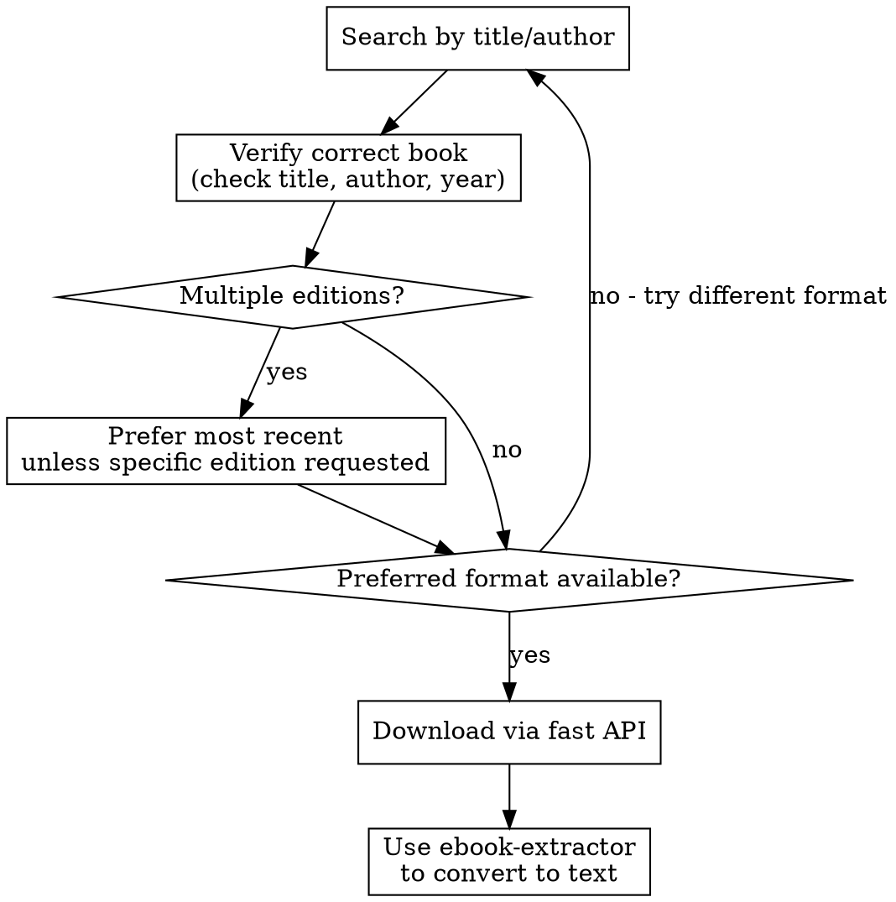

# Anna's Archive Ebook Lookup & Download

## Overview

Search and download ebooks from Anna's Archive, which indexes millions of books across formats (PDF, EPUB, MOBI, etc.).

## Prerequisites

**IMPORTANT: Downloads require an Anna's Archive membership key.**

Before using download functionality, the user must:
1. Have an Anna's Archive membership (https://annas-archive.org/donate)
2. Set their API key: `export ANNAS_ARCHIVE_KEY="your-key"`

The key is found in Account Settings after becoming a member. Search works without a key, but downloads will fail.

**If key is not set:** Inform the user they need to set `ANNAS_ARCHIVE_KEY` and provide the setup instructions above.

## When to Use

- User asks to find/download a book
- Need to look up content from a published book
- Searching for a specific edition or format
- "Get me the PDF of Clean Code"
- "Find the latest edition of Design Patterns"

## Quick Reference

| Task | Command |
|------|---------|
| Search | `python3 annas.py search "query" --format pdf` |
| Get details | `python3 annas.py details <md5>` |
| Download | `python3 annas.py download <md5> --output /path/` |
| Verify match | `python3 annas.py search "title author" --verify "expected title"` |

## Environment Setup

```bash
export ANNAS_ARCHIVE_KEY="your-membership-key"
```

The key is found in your Anna's Archive account settings.

## Workflow



## Common Patterns

### Find and download a book
```bash
# Search with format preference
python3 annas.py search "Clean Code Robert Martin" --format pdf --limit 5

# Verify it's the right book, get details
python3 annas.py details adb5293cf369256a883718e71d3771c3

# Download
python3 annas.py download adb5293cf369256a883718e71d3771c3 --output ./books/
```

### Handle multiple editions
When search returns multiple editions:
1. Check year - prefer most recent unless user specified edition
2. Check format - match user's preference (pdf/epub)
3. Verify author matches exactly

### Format Priority
Default priority when user doesn't specify: `pdf > epub > mobi > azw3 > djvu`

## API Details

**Search endpoint:** `https://annas-archive.org/search`
- `q` - query string
- `ext` - format filter (pdf, epub, mobi, azw3, djvu)
- `sort` - `year_desc` for most recent first

**Fast download API:** `https://annas-archive.org/dyn/api/fast_download.json`
- `md5` - book identifier
- `key` - from ANNAS_ARCHIVE_KEY env var

## Common Mistakes

| Mistake | Fix |
|---------|-----|
| Key not set | Check `echo $ANNAS_ARCHIVE_KEY` |
| Wrong edition | Use `--verify` flag with expected title |
| Format mismatch | Explicitly set `--format` |
| Book not found | Try shorter query, author name variations |

## Converting to Text

Downloaded files are in their original format (PDF, EPUB, MOBI, etc.). To convert to plain text for analysis or processing, use the **ebook-extractor** skill after downloading.

Typical workflow:
1. Download with this skill → `books/Clean_Code.pdf`
2. Convert with ebook-extractor → `books/Clean_Code.txt`

## Mirror Fallback

The script automatically tries multiple mirror domains if the primary domain is unavailable:
- annas-archive.org (primary)
- annas-archive.li
- annas-archive.se
- annas-archive.in
- annas-archive.pm

The first working mirror is cached for the session. You'll see `Using mirror: <domain>` in stderr when a fallback is used.

## Error Handling

- **"Invalid md5"** - MD5 hash is malformed or doesn't exist
- **"Not a member"** - Key is invalid or expired
- **No results** - Broaden search terms, try author-only search
- **"Could not connect to any mirror"** - All mirrors are down, try again later

## Troubleshooting

### SSL Certificate Error on macOS

If you see this error:
```
[SSL: CERTIFICATE_VERIFY_FAILED] certificate verify failed: unable to get local issuer certificate
```

This happens because Python can't find the system's CA certificate bundle on macOS.

**Quick Fix:**

1. Install certifi:
   ```bash
   pip3 install certifi
   ```

2. Find your certificate path:
   ```bash
   python3 -c "import certifi; print(certifi.where())"
   ```

3. Add to `~/.zshrc`:
   ```bash
   export SSL_CERT_FILE=/path/from/step/2/cacert.pem
   ```

4. Reload shell: `source ~/.zshrc`

**Verify it works:**
```bash
python3 -c "import urllib.request; urllib.request.urlopen('https://google.com')"
```

**Why this happens:** macOS uses Keychain for certificates, but Python doesn't use it by default. Framework installs (like `/Library/Frameworks/Python.framework`) often lack certificate configuration.

**Do NOT** use `verify=False` or `PYTHONHTTPSVERIFY=0` - this disables SSL entirely and is insecure.
