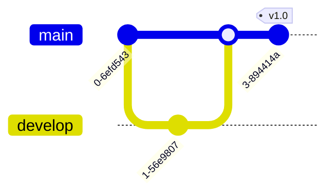

# Mermaid Cheat Sheet

Quick reference for common Mermaid patterns.

---

## Flowchart (Quick Start)


**Directions:** `TB` `TD` `BT` `LR` `RL`

**Shapes:**
```
[rect]  (rounded)  ((circle))  {diamond}  {{hexagon}}
[(cylinder)]  [[subroutine]]  ([stadium])  >asymmetric]
```

**Arrows:**
```
-->      Arrow
---      Line
-.->     Dotted arrow
==>      Thick arrow
--o      Circle end
--x      Cross end
<-->     Bidirectional
```

**With text:** `A -->|label| B` or `A -- label --> B`

---

## Sequence Diagram (Quick Start)


**Arrows:**
```
->      Solid, no head
->>     Solid with head
-->     Dotted, no head
-->>    Dotted with head
-x      Solid with X
-)      Async (open arrow)
```

**Activation:** `+` activates, `-` deactivates

**Blocks:**
```
loop Label        alt Condition       opt Optional
    ...               ...                 ...
end               else                end
                      ...
                  end

par Action 1      critical Section
    ...           option Fallback
and Action 2          ...
    ...           end
end
```

---

## Class Diagram (Quick Start)


**Visibility:** `+` public, `-` private, `#` protected, `~` package

**Relationships:**
```
<|--    Inheritance
*--     Composition
o--     Aggregation
-->     Association
..>     Dependency
..|>    Realization
```

---

## State Diagram (Quick Start)


**Special states:** `[*]` (start/end), `<<choice>>`, `<<fork>>`, `<<join>>`

**Composite:**
```
state Active {
    [*] --> Running
    Running --> Stopped
}
```

---

## ER Diagram (Quick Start)


**Cardinality:**
```
||    Exactly one
o|    Zero or one
|{    One or more
o{    Zero or more
```

Read: left to right. `||--o{` = one-to-many

---

## Gantt (Quick Start)


**Task states:** `:done`, `:active`, `:crit`

---

## Pie Chart


---

## Mindmap


**Shapes:** `[square]` `(rounded)` `((circle))` `{{hexagon}}`

---

## Timeline


---

## Quadrant Chart


---

## Git Graph



---

## User Journey


Score: 1 (frustrated) to 5 (happy)

---

## Configuration

**Theme (in frontmatter):**
```
---
config:
    theme: forest
---
```

**Theme (inline):**
```
%%{init: {'theme': 'dark'}}%%
```

**Themes:** `default` `forest` `dark` `neutral` `base`

---

## Comments

```
%% This is a comment
```

---

## Common Patterns

### Decision Tree


### API Flow


### System Architecture


### State Machine

