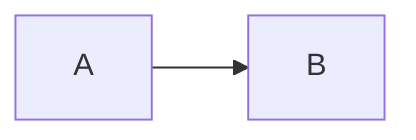
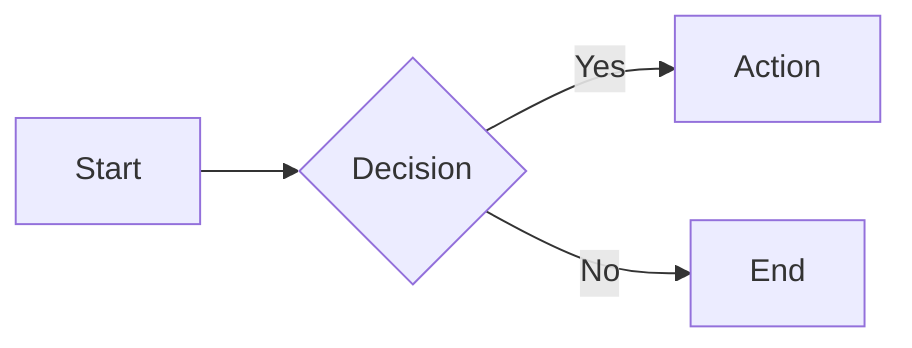
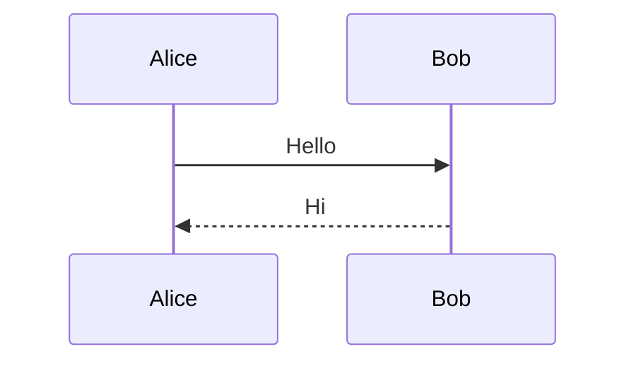
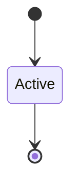

# Notes

## Reference Documents

- **[mermaid-syntax-reference.md](./mermaid-syntax-reference.md)** - Complete syntax for all 17+ diagram types
- **[mermaid-cheatsheet.md](./mermaid-cheatsheet.md)** - Quick reference with copy-paste examples

## Mermaid Inputs

- Mermaid diagrams are plain text that start with a diagram type keyword:
  - `flowchart LR` / `flowchart TD`
  - `sequenceDiagram`
  - `classDiagram`
  - `stateDiagram-v2`
  - `erDiagram`
  - `gantt`
  - `pie`
  - `mindmap`
  - `timeline`
  - `quadrantChart`
  - `gitGraph`
  - `journey`
  - And more...

- If rendering a Markdown file, this skill only extracts triple-backtick blocks fenced with `mermaid`:

```md

```

## Tips for Terminal Previews

- Use a monospace font; Unicode box-drawing characters render best with a font that supports them well
- If diagrams look "squished", try increasing your terminal window width
- Keep diagrams simple for better ASCII rendering
- Use short labels to avoid overflow/wrapping
- Prefer LR (left-right) or TB (top-bottom) directions
- Avoid deeply nested subgraphs
- Test complex diagrams incrementally

## Quick Examples

### Flowchart


### Sequence


### State

