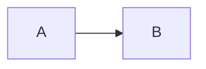

# Notes

## Mermaid inputs

- Mermaid diagrams are plain text that start with a diagram type, e.g.:
  - `flowchart LR`
  - `sequenceDiagram`
  - `stateDiagram-v2`
- If rendering a Markdown file, this skill only extracts triple-backtick blocks fenced with `mermaid`:

```md

```

## Tips for terminal previews

- Use a monospace font; Unicode box-drawing characters render best with a font that supports them well.
- If diagrams look “squished”, try increasing your terminal window width.

