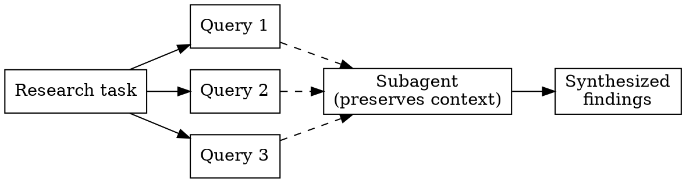
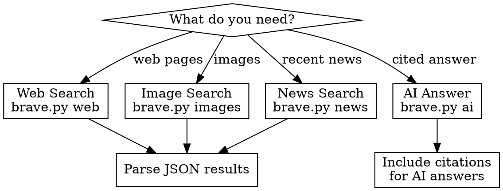

# Brave Search API

## Overview

Search the web, images, and news using Brave's privacy-focused Search API. Also supports AI Grounding for cited answers via OpenAI SDK compatibility.

## Prerequisites

**API Key required.** Get one at https://api-dashboard.search.brave.com

```bash
export BRAVE_API_KEY="your-api-key"
```

Free tier: 2,000 queries/month. Pro plans unlock Local POI search and AI Grounding.

## When to Use

- Searching the web for current information
- Finding images on a topic
- Getting recent news articles
- AI-grounded answers with citations
- Autocomplete suggestions
- Location/POI searches (Pro plan)

## High-Throughput Usage

**Go wide, go fast.** This API supports high concurrency—up to 50 requests/second. Don't hold back:

- **Fire searches in parallel.** Need to research 10 different topics? Launch 10 searches simultaneously. Use multiple Bash tool calls in a single message.
- **Use subagents for heavy results.** When expecting lots of context (many results, extra snippets, research mode), dispatch a subagent to run the search and synthesize findings. This preserves your main context window.
- **Batch related queries.** Searching for competitors, alternatives, or multiple aspects of a topic? Run them all at once.



**When to use subagents:**
- Searching for many sources on a topic (launch search subagent, return summary)
- Deep research with AI Grounding (high token usage, let subagent handle)
- Comparing multiple options (run parallel searches, subagent synthesizes)

**When to search directly:**
- Quick single queries where you need the raw URLs/snippets
- Low result counts where context isn't a concern

## Quick Reference

| Task | Command |
|------|---------|
| Web search | `brave-search web "query"` |
| Image search | `brave-search images "query"` |
| News search | `brave-search news "query"` |
| AI answer | `brave-search ai "question"` |
| Suggestions | `brave-search suggest "partial query"` |
| Check key | `brave-search check-key` |

## API Endpoints

| API | Endpoint | Plan |
|-----|----------|------|
| Web Search | `/res/v1/web/search` | Free |
| Image Search | `/res/v1/images/search` | Free |
| News Search | `/res/v1/news/search` | Free |
| Suggest | `/res/v1/suggest/search` | Free |
| AI Grounding | `/res/v1/chat/completions` | AI Grounding |
| Local POI | `/res/v1/local/pois` | Pro |
| Summarizer | `/res/v1/summarizer/search` | Pro |

## Common Parameters

### Web Search
```bash
# Basic search
brave-search web "python async tutorial" --count 10

# Filter by freshness (pd=24h, pw=7d, pm=31d, py=365d)
brave-search web "latest news" --freshness pd

# Filter by country and language
brave-search web "local restaurants" --country US --lang en

# Safe search (off, moderate, strict)
brave-search web "query" --safesearch strict

# Get extra snippets
brave-search web "query" --extra-snippets

# Filter result types (web, news, videos, images, discussions)
brave-search web "query" --filter web,news
```

### Image Search
```bash
# Basic image search
brave-search images "mountain sunset"

# With safe search
brave-search images "landscape" --safesearch strict --count 20
```

### News Search
```bash
# Recent news
brave-search news "AI developments" --count 10

# News with freshness filter
brave-search news "election results" --freshness pd
```

### AI Grounding (Cited Answers)
```bash
# Get an AI answer with citations
brave-search ai "What is the tallest building in the world?"

# Enable deep research (multiple searches, slower)
brave-search ai "Compare React and Vue in 2024" --research
```

## Workflow



## Response Structure

### Web Search Results
```json
{
  "web": {
    "results": [
      {
        "title": "Page Title",
        "url": "https://example.com",
        "description": "Snippet from the page...",
        "extra_snippets": ["Additional context..."]
      }
    ]
  },
  "query": {
    "original": "search query",
    "altered": "modified query if spellchecked"
  }
}
```

### AI Grounding Response
Returns OpenAI-compatible format with inline citations:
```
The tallest building is the Burj Khalifa[1] at 828 meters...

[1] https://source-url.com
```

## Common Options

| Option | Values | Description |
|--------|--------|-------------|
| `--count` | 1-20 (web), 1-200 (images) | Number of results |
| `--country` | US, GB, DE, FR, etc. | Search region |
| `--lang` | en, de, fr, es, etc. | Search language |
| `--safesearch` | off, moderate, strict | Adult content filter |
| `--freshness` | pd, pw, pm, py | Time filter |
| `--json` | flag | Output raw JSON |

## Error Handling

| Error | Cause | Fix |
|-------|-------|-----|
| 401 Unauthorized | Invalid/missing API key | Check `BRAVE_API_KEY` |
| 429 Rate Limited | Too many requests | Wait or upgrade plan |
| 422 Validation | Invalid parameters | Check parameter values |

## Rate Limits

- **Free**: 1 req/sec, 2,000/month
- **Pro**: Higher limits, check dashboard
- Response headers show remaining quota: `X-RateLimit-Remaining`

## Common Mistakes

| Mistake | Fix |
|---------|-----|
| API key not set | `export BRAVE_API_KEY="..."` |
| Wrong endpoint for plan | Check subscription at dashboard |
| Too many results | Web max is 20, use offset for pagination |
| No AI grounding | Requires AI Grounding subscription |
